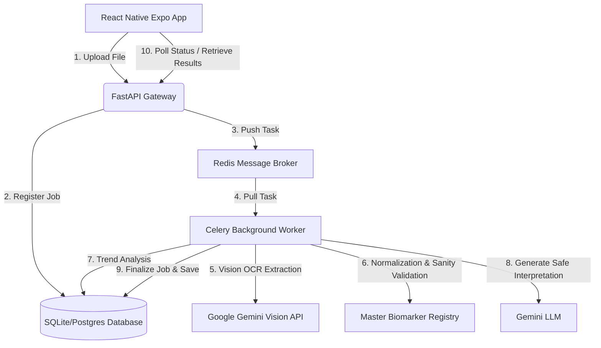
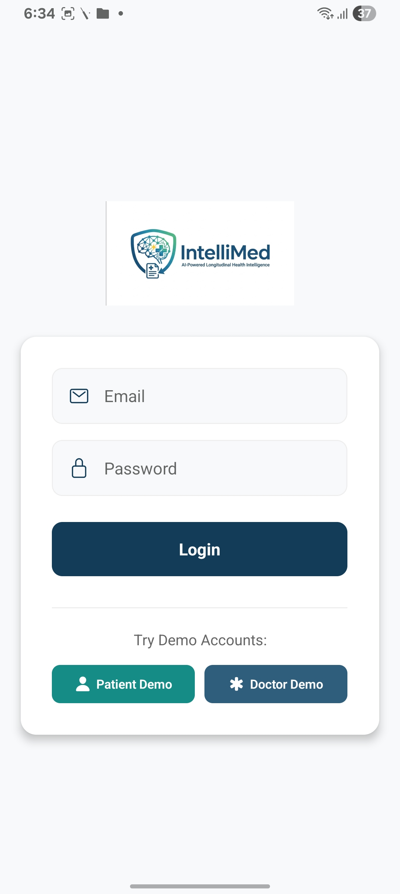
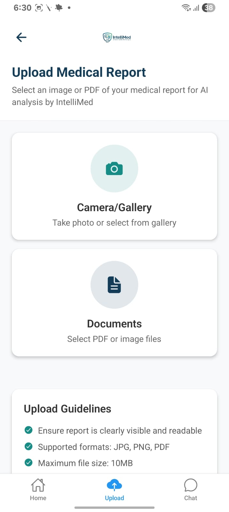
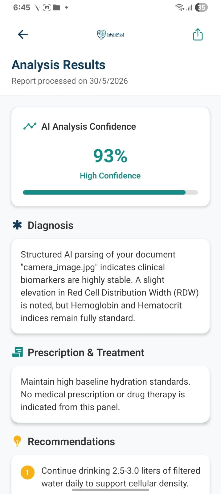
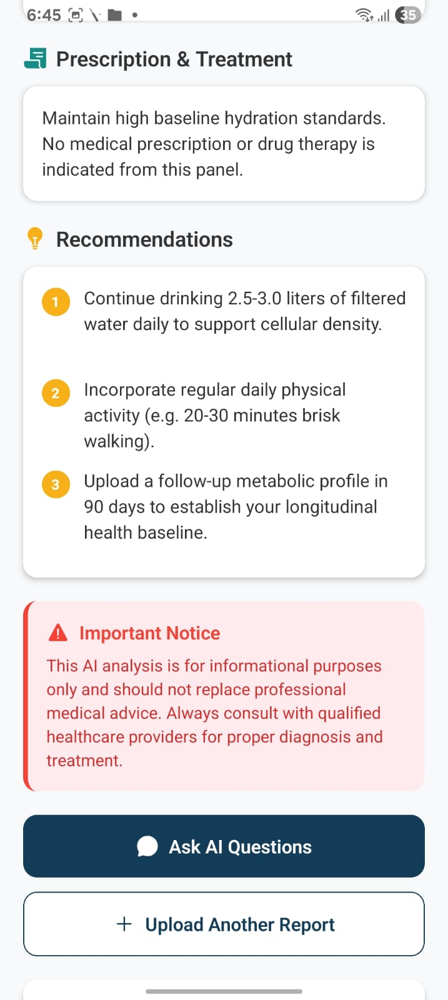
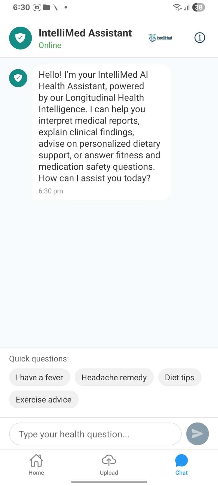
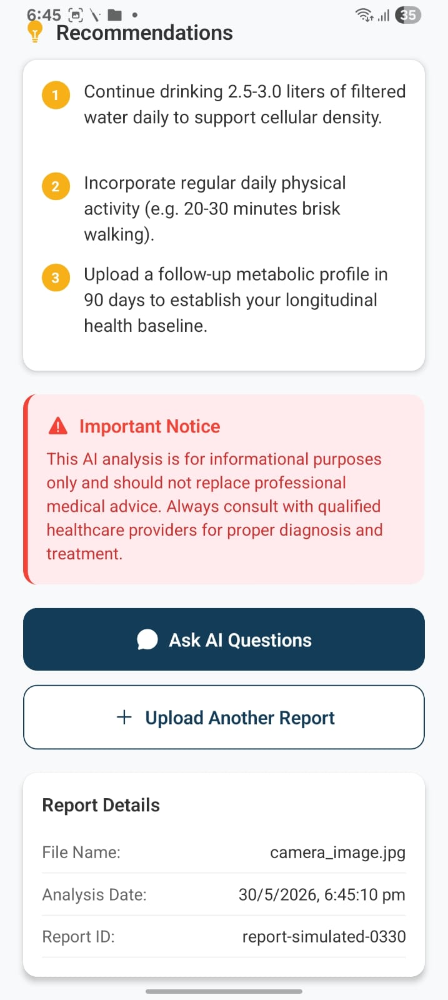
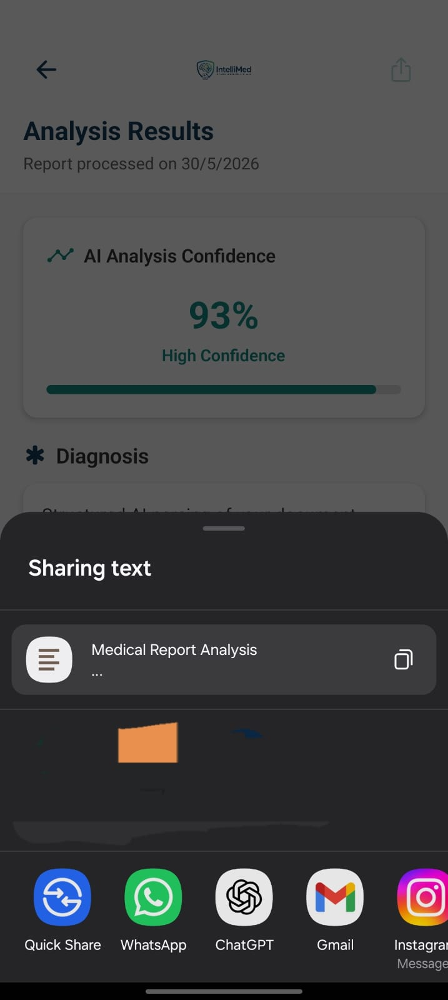

# 🩺 IntelliMed — AI-Powered Longitudinal Health Intelligence

## 🚀 Overview
**IntelliMed** is a premium React Native healthcare application designed to deliver **AI-Powered Longitudinal Health Intelligence**. It provides patients and clinical practitioners with highly accurate, structured clinical OCR interpretations, AI chatbot guidance, and longitudinal diagnostic history tracking.

> [!WARNING]
> **Clinical Disclaimer**: IntelliMed is designed strictly for informational and clinical tracking support purposes. It does not replace professional medical diagnosis, advice, or therapy. Always consult with a qualified primary care physician.

---

## 🏗️ System Architecture & Design

IntelliMed is engineered with a decoupled, highly scalable event-driven architecture designed to process medical reports asynchronously without blocking client APIs.

### System Architecture Flowchart


### 🧱 Core Architecture Layers

1.  **Frontend Interface (React Native / Expo)**:
    *   State-driven session validation utilizing secure `AsyncStorage` tokens.
    *   Responsive layouts styled around the custom corporate palette (**Navy**, **Teal**, **Amber Gold**).
    *   Conditional stack navigation preventing unauthorized routing transitions.
    *   Dynamic offline simulation support for immediate testing and presentation.
2.  **API Gateway (FastAPI)**:
    *   Asynchronous REST endpoints for ultra-low latency routing.
    *   JWT credentials checking for user authentication.
    *   Unified CORS handling for local Expo host routing.
3.  **Task Queue & Pipeline Broker (Celery + Redis)**:
    *   Asynchronous file parsing pipeline to isolate resource-heavy OCR operations.
    *   Redis serves as the rapid in-memory database broker.
    *   Celery workers manage job status sequences (`preprocessing`, `ocr_extracting`, `analyzing`, `completed`, `failed`).
4.  **AI & Interpretation Pipeline (Gemini Pro & Vision)**:
    *   **Vision OCR**: High-confidence text capture of scanned PDF/image reports.
    *   **Normalization Service**: Standardizes clinical biomarker synonyms (e.g., matching "Glucose", "Fasting Sugar", and "FPG" to a single master record).
    *   **Clinical Boundary Safeguards**: Rejects files with confidence scores < 85% or inputs that fail biological boundary ranges.
5.  **Database Storage**:
    *   SQL database (`health_intelligence.db` used for local development) managing tables for `Users`, `Report`, `BiomarkerTrend`, `ProcessingJob`, and `PipelineAuditLog`.

---

## 📸 Application Screenshot Gallery

Here are the actual visual previews of **IntelliMed** in action, showcasing the premium **HSL Corporate Navy and Teal** styling overhaul:

| Screen Name | Preview Image | Key Functionality |
| :--- | :---: | :--- |
| **Login Screen** |  | Branded with the official logo, featuring offline bypasses for demo accounts. |
| **Patient Home Dashboard** |  | Welcome greeting, quick action triggers, and recent laboratory report history feed. |
| **Analyzed Report Results** |  | Asynchronous AI clinical interpretation card presenting diagnosis and suggested therapies. |
| **Lifestyle Recommendations** |  | Actionable lifestyle adjustments and longitudinal clinical advice parameters. |
| **AI Clinical Assistant** |  | Multilingual interactive guidance powered by custom clinical guidelines. |
| **Report-Grounded Chat** |  | Directly query details, diets, and metabolic indexes based on active report context. |
| **Shareable Interpretation** |  | Export, share results, and track detailed metadata indices. |

---

## 📦 Installation & Setup

### Frontend Installation
```bash
# Clone the repository
git clone https://github.com/audhee/IntelliMed.git
cd IntelliMed

# Install node dependencies
npm install

# Start the Expo Dev Server (with cache clear to index new logo assets)
npx expo start --clear
```

### Backend Installation & Startup
```bash
# Navigate to the backend folder
cd backend

# Activate your Python virtual environment (Windows)
.\venv\Scripts\Activate.ps1

# Install requirements
pip install -r requirements.txt

# Start the FastAPI server
uvicorn app.main:app --reload --host 0.0.0.0 --port 5000
```

### Running the Celery Worker
Ensure your **Redis** server is running, then launch the background worker in a separate activated terminal:
```bash
celery -A app.worker.celery_app worker --loglevel=info
```

---

## 🔑 Environment Variables

Create a `.env` file in the `backend` directory matching the following structure:
```env
APP_NAME="IntelliMed API"
APP_ENV="development"
DATABASE_URL="sqlite:///health_intelligence.db"
REDIS_URL="redis://localhost:6379/0"
GEMINI_API_KEY="your_google_gemini_api_key_here"
JWT_SECRET="your_secure_jwt_secret_token_here"
```
